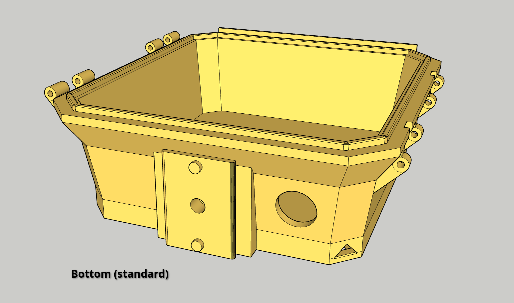

# Open Source Traffic Monitor Enclosure 3D Printing Models

The Traffic Monitor (TM) enclosure is designed to comfortably house your Raspberry Pi -based traffic monitoring equipment.

Visit the [Traffic Monitor homepage](https://www.trafficmonitor.ai) or the [Traffic Monitor GitHub repo](https://github.com/glossyio/traffic-monitor) to learn more about the project, instructions to build your own, and links to buy it.

**What does this repo contain?**

This repository contains the `.stl` files for the [Traffic Monitor](https://www.trafficmonitor.ai) 3D enclosure to print via your FDM 3D Printer.

## Features

- Outdoor, weatherproof design to prevent water and dust infiltration for your traffic monitor components
- Designed to fit the Traffic Monitor with the recommended hardware: camera, radar, and AI co-processor.
- 1/4"-20 screw inserts for compatability with a variety of camera -style mounting hardware
- VESA mount -compatible hole inserts at 75 and 100 mm, designed for M4 screw inserts (not included)

## Assembly

See Traffic Monitor Build Your Own Device documentation for assembling your TM (_coming soon_)

**Additional Components**

- Required: Polycarbonate, acrylic, or glass for window insert, recommend sealing with silicon adhesive
- Required: Six (6) of 3mm x 45mm steel dowel pins for hinges (2), latch (2), and latch catch (2)
- Required: Four (4) of M3 * 4mm screw inserts for Enclosure Top mounting board hold down
- Optional: Mounting screw inserts
    - Two (2) of 1/4"-20 
    - Eight (8) of M4 * 5 * 5mm screw inserts for VESA mount -compatible holes
- Optional: Mounting hardware (dependent on mounting conditions)
- Recommended: Tether with small caribiner clip for mounting failsafe

## Printing Notes

This is designed to be printed without supports to minimize plastic waste and post-printing work, using the 45-degree rule, but YMMV.

** Material Notes **
- ABS or ASA recommended for outdoors; however, these matrials are harder to work.
- PETG is a good alternative but provides less UV protection; it is recommended you paint it prior to deployment, starting with a good primer coat.
- PLA may be used for indoor-only uses or test prints.
