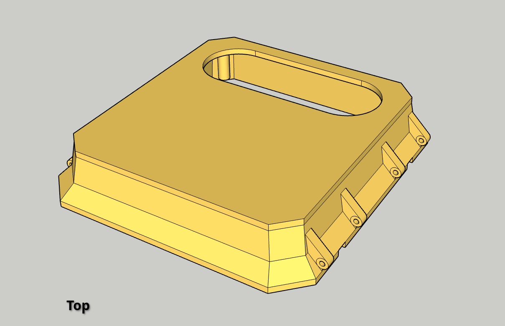

# Open Source Traffic Monitor Enclosure 3D Printing Models

The [TrafficMonitor.ai](https://www.trafficmonitor.ai), Traffic Monitor (TM), enclosure is designed to comfortably house your Raspberry Pi -based traffic monitoring equipment including up to 2 RPi cameras, 1 radar, the Raspberry Pi 5, AI co-processor Hat, and environmental sensors (for the AQ version).

Visit the [Traffic Monitor GitHub repo](https://github.com/glossyio/traffic-monitor) and the [TrafficMonitor.ai docs](https://docs.trafficmonitor.ai) to learn more about the project and download the software, for instructions to build your own, and links for bill of materials.

**What does this repo contain?**

This repository contains the `.stl` files for the Traffic Monitor 3D enclosure parts to print with your FDM 3D Printer. Download and print these files to build your own Traffic Monitor enclosure.

## Features

- Outdoor, weather-resistant design to prevent water and dust infiltration for your traffic monitor components (IP-52 to IP-65, depending on model, not certified).
- Designed to fit the Traffic Monitor recommended hardware: camera, radar, and AI co-processor. For environmental / air quality sensors see AQ enclosure.
- Measures roughly 190mm x 190mm x 95mm (≅ 7.5in x 7.5in x 3.75in) and weighs 250 grams (≅ 8.8 oz) empty
- 1/4"-20 screw insert holes on bottom and back (depending on model) for compatability with a variety of camera -style mounting hardware.
- Built-in Arca-Swiss Quick Release System -compatible plate to quickly and easily clamp onto compatible tripods.
- VESA mount -compatible M4 screw insert holes at 75 and 100 mm on the back.
- Strap mount slots available for additional mounting options. 

## Parts to print

Tip: Mix and match colors between components to create an interesting look! 

**Standard enclosure**:
- Bottom (standard)
- Top + Window Cover
- Mounting Board + Carrier Board
- Camera mount for RPi Cam 3
- 2 x Latch

**Air Quality enclosure**:
- Bottom (AQ)
- Top + Window Cover
- Mounting Board + Carrier Board
- Camera mount for RPi Cam 3
- 2 x Latch
- AQ clip

## Printing Notes

Your print bed will need to be at least 200mm x 200mm width x length to fit the enclosure top and bottom.

Estimated material usage: ~300g with all components, depending on print settings.

Designed to be printed without supports to minimize plastic waste and post-printing work, using the 45-degree rule.

**Materials**

- (Recommended) ABS or ASA are recommended for outdoor deployment; however, these matrials are often more difficult to print due to warping and curling.
- (Alternative) PETG is a good alternative to ASA but provides less UV protection. Recommend to prime and paint the exterior prior to deployment.
- (Not recommended) PLA may be used for indoor-only deployments or test prints, but it will not stand up to the elements if placed outdoors or in hot conditions such as in the sun on the window.

**Printer Settings**

- Infill may be set as low as 8% or less, as the case will still be strong and weather-resistant protect internal components.
- Walls should be multiple layer (3+ layers), especially when screw inserts are used for strength.
- Supports are unnecessary, as design was made with the 45-degree rule wherever possible.

## Bill of Materials for Enclosure

The enclosure requires a few commodity components to complete the build.  Required components are noted:

- (Required) Window insert of polycarbonate, acrylic, or glass; recommend sealing with silicon adhesive.
- (Required) Six (6) of 3mm x 45mm steel dowel pins or screws for hinges (2), latch (2), and latch catch (2).
- (Required) Four (4) of M3 * 4mm screw inserts for Enclosure Top mounting board hold down.
- (Required) Four (4) of M3 x 16mm button head socket cap screws with nuts for mounting Raspberry Pi Carrier board to mounting board
- (Optional) Four (4) of M2.5 x 12mm button head socket cap screws with nuts for mounting RPi GS Camera
- (Optional) Four (4) #8 x 1/2" Self-drilling screws for mounting GS camera mount to mounting board
- (Recommended) Silicon beading for waterproofness on rim inset.
- (Optional) Mounting screw inserts on enclosure:
    - Up to two (2) of 1/4"-20 screw inserts on bottom and back
    - Up to eight (8) of M4 * 5 * 5mm screw inserts on back for VESA mount -compatible holes
- (Optional) Mounting hardware (dependent on mounting conditions).
- (Recommended): Tether with small caribiner clip to act as a mounting failsafe.

## Next Steps

### Assembly

See the [Build Your Own Device documentation](https://docs.trafficmonitor.ai/build-your-own-device-diy) for assembling your TM.

### Deployment and Mounting

See the [Deployment and Mounting Guide](https://docs.trafficmonitor.ai/deployment-and-mounting-guide) for physical placement suggestions.

# Disclaimer

> [!CAUTION]
>
> This 3D print model of an external enclosure for a camera is provided "as is" without any warranty, express or implied. The owner and contributors of this repository disclaim all liability for any damages or losses arising from the use of this model. By using this model, you acknowledge that you are responsible for ensuring the enclosure's weather-proofness, durability, and overall suitability for your specific application. You also acknowledge that the owner and contributors are not responsible for any damage to your camera or other equipment that may result from using this enclosure. 
>
> Additionally, the owner and contributors are not responsible for how you choose to use, mount, or deploy the enclosure, and you agree to comply with all applicable laws and regulations in your jurisdiction regarding the use of cameras and surveillance equipment. It is your sole responsibility to ensure that your use of this enclosure does not infringe on the rights of others, violate any privacy laws, or otherwise contravene any local, state, or federal regulations. Use this model at your own risk.